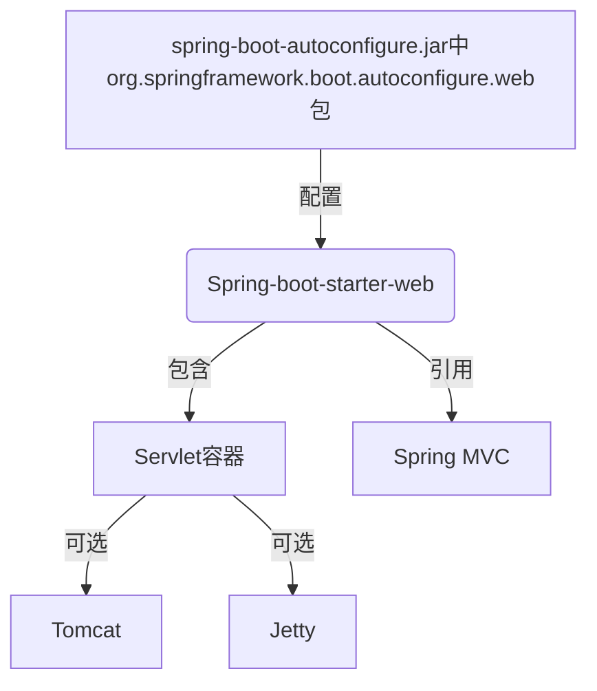
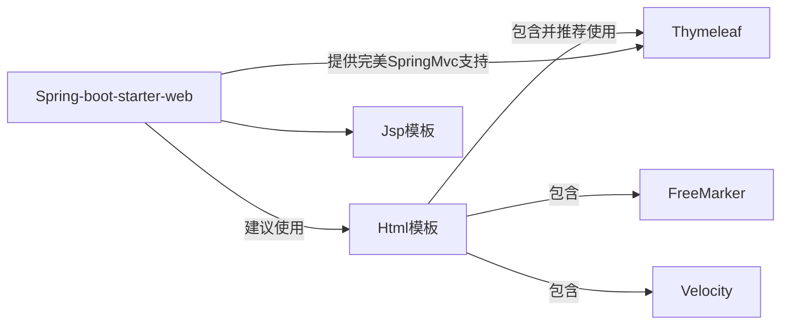
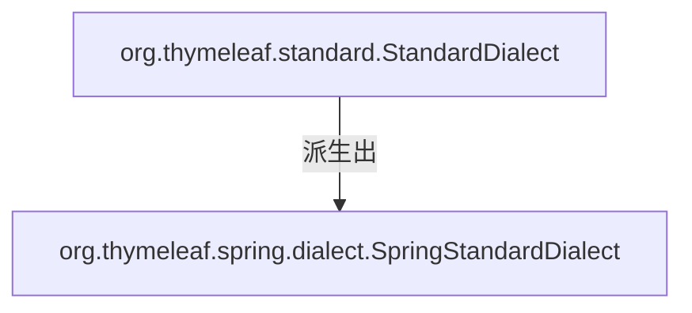
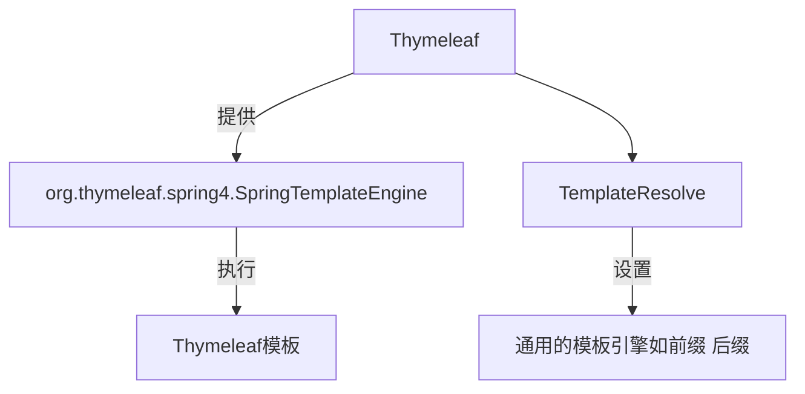
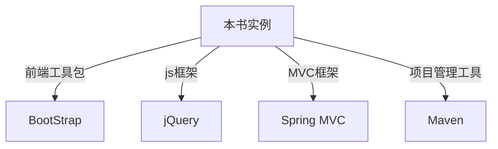
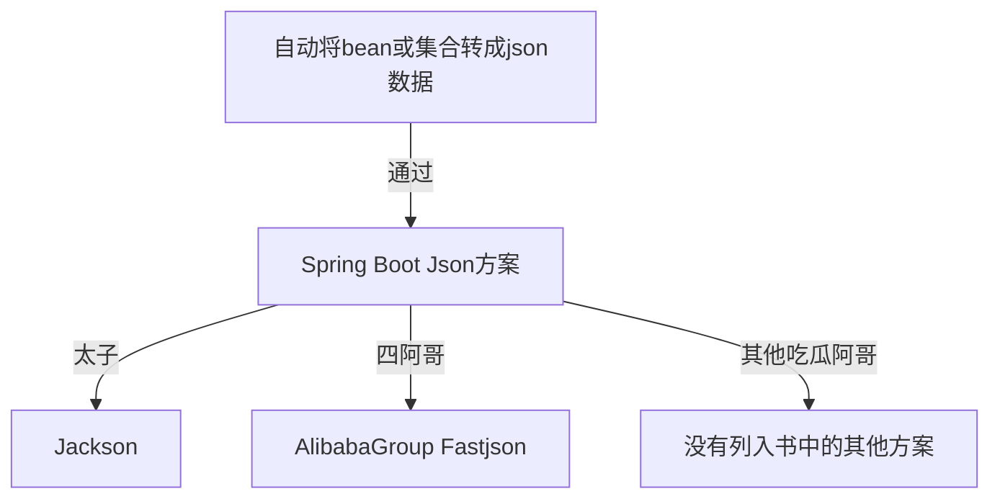

# 第3章
## 3.1 Spring Boot的Web开发支持




#### 常见web相关的自动配置支持类

| 方面                           | 配置类                                                |
| ------------------------------ | ----------------------------------------------------- |
| Http的编码                     | HttpEncodingAutoConfiguration和HttpEncodingProperties |
| Jackson的Convertor相关（json） | JacksonHttpMessageConvertersConfiguration             |
| 上传文件                       | MultipartAutoConfiguration和MultipartProperties       |
| Servlet容器                    | ServerPropertiesAutoConfiguration和ServerProperties   |
| Web MVC                        | WebMvcAutoConfiguration和WebMvcProperties             |


## 3.2 Thymeleaf 模板引擎




- 优点
  - 自然模板——不污染Html，方便开发人员和设计人员衔接，同一份文件，不用在html和jsp之间来回捯饬。
  - 受官方支持——使用Spring生态的程序员还有啥理由不掌握呢？

- 语法

  - 引入Thymeleaf

  ```html
  <html xmlns:th="http://www.thymeleaf.org">
  ```

  - 引入url：

    ```jsp
    @{url地址}
    ```

    | 类型     | 用法                                                         |
    | -------- | ------------------------------------------------------------ |
    | 绝对路径 | < a th:href="@{http://www.nowcoder.com}">牛客网</a>          |
    | 相对路径 | < a th:href="@{/}">相对路径</a>                              |
    | 静态文件 | < a th:href="@{css/bootstrap.min.css}">Content路径，默认访问static文件夹下的css文件夹。</a> |

  - 表达式：用于从WebContent中取 请求参数，请求、会话和应用程序中的属性，和EL表达式非常类似

    - ${x}:将返回存储在thymeleaf上下文中的变量x或作为请求Request作用域中的属性
    - $(param.x):将返回一个名为x的请求参数（可能是多值的）
    - $(session.x):将返回一个名为x的会话HttpSession作用域中的属性。
    - $(application.x):将返回一个名为x的全局ServletContext上下文作用域中的属性。
    - 注1：和EL表达式一样，用$符号获取变量值（用 对象名.属性名 获取JavaBean对象的属性）。
    - 注2：$表达式只能写在th标签内部，否则不会生效。

  - 字符串操作

    - 拼接字符串

    ```html
    < span th:text="'Welcome to nowcoder,' + ${user.name} + '!'">
    ```

    - 简便写法

      ```html
      < span th:text="|Welcome to nowcoder,${user.name}!|">
      ```

      - 注:简便写法限制较多，|...|中只能包含变量表达式${...}，不能包含其他常量、条件表达式等。

  - 运算符

    - 算术运算符：+、-、*、/、%

      ```php+HTML
      th:with="isEven=(${prodStat.count} % 2 == 0)"
      ```

    - 逻辑运算符：>、<、>=、<=、==、!=

      - 注：因为Thymeleaf是在Html中使用，所以>和<符号要使用Html转义。

      ```php+HTML
      th:if=“${prodStat.count} &gt; 1”
      th:text="'Execution mode is '+((${execMode}=='dev')?'Development':'Production')"
      ```

  - 条件判断:

    -  th:if:条件成立

      ```php+HTML
      < a th:href="main.html" th:if="${username != null }">login</a>
      ```

    - th:unless条件不成立

      ```php+HTML
      < a th:href="main.html" th:unless="${username != null }">login</a>
      ```

    - th:switch,th:case

      ```php+HTML
      < div th:switch="${role}">
          < p th:case="'admin'">        User is an administrator    </p>
          < p th:case="'manager'">        User is a manager    </p>
          < p th:case="*">        User is some other thing   </p>    
      </div>
      ```

      注：*表示其他语言中的default（默认项）选项。

  - 循环：th:each

    用于迭代循环，迭代对象可以是java.util.List,java.util.Map或数组等。语法：

    ```php+HTML
    th:each="obj,iterStat:${objList}"
    ```

    简单循环可以不用iterStat，如：

    ```php+HTML
    < tr th:each="book : ${books}">
        < td th:text="${book.title}">大肥牛带你剑指Offer</td>
        < td th:text="${book.author}">牛晓东</td>
        < td th:text="${book.remark}">做大牛不做大肥牛</td>
    </tr>
    ```


    iterStat表示状态变量，属性如下
    
    | 属性     | 说明                                                   |
    | -------- | ------------------------------------------------------ |
    | index    | 当前迭代对象的位置,从0开始                             |
    | count    | 当前迭代对象的位置，从1开始                            |
    | size     | 集合大小或被迭代对象的大小                             |
    | current  | 当前迭代变量                                           |
    | even/odd | 布尔值，当前是偶数还是奇数，从0开始计算，等同于index%2 |
    | first    | 布尔值，当前循环是否是第一个，从1开始算                |
    | last     | 布尔值，当前循环是否是最后一个。                       |

  - 内置对象：#号开头，常以s结尾，方便开发的一些常用对象。如dates,lists,numbers等。常用如下：

    | 对象名称    | 作用                                                         |
    | ----------- | ------------------------------------------------------------ |
    | #dates      | 日期格式化内置对象，参照java.util.Date                       |
    | #calendars  | 类似于#dates，但是是java.util.Calendar类的方法               |
    | #numbers    | 数字格式化                                                   |
    | #strings    | 字符串格式化，具体方法可以参照java.lang.String，如startsWith,contains等 |
    | #objects    | 参照java.lang.Objects                                        |
    | #bools      | 判断boolean类型的工具                                        |
    | #arrays     | 数组操作的工具                                               |
    | #lists      | 列表操作的工具，参考java.util.List                           |
    | #sets       | Set操作工具，参考java.util.Set                               |
    | #maps       | Map操作工具，参考java.util.Map                               |
    | #aggregates | 操作数组或集合的工具                                         |
    | #messages   | 操作消息的工具                                               |

    示例：略。


## 3.3 Spring和Thymeleaf 的整合

最新版本的支持封装在thymeleaf-spring5库中，整合后可以在spring mvc应用中完全替代jsp文件。

- 使用@Controller注解来映射Thymeleaf的模板文件
- 在模板中使用SpringEL表达式来替换OGNL。
- 在模板中创建的表单，完全支持Beans和结果的绑定，包括使用PropertyEditor、转换和验证等。
- 可以通过Spring来管理国际化文件显示国际化信息

themeleaf 在spring中的方言



SpringStandardDialect特点：

- Thymeleaf不适用OGNL，而是SpringEL实现变量表达式，因此，所有的${...}和*{...}表达式将用Spring的表达式引擎进行处理。
- 访问应用context中的Beans可以使用SpringEL语法：${@myBean.doSomeThing()};
- 基于表格处理的新属性：th:field,th:errors和th:errorclass，此外还有一个th:object的新实现，允许它使用表单命令选择器。
- 在Spring 5.0集成中提供多个新的表达式。




## 3.4 Spring Boot的Thymeleaf 支持

spring boot 通过org.springframework.boot.autoconfigure.thymeleaf包对Thymeleaf进行自动配置。

其下最重要两个包：

ThymeleafAutoConfiguration:对集成所需要的Bean进行自动配置，包括templateEngine和templateResolver的配置。

ThymeleafProperties:读取application.properties配置文件，设置Themeleaf的属性以及默认配置。

## 3.5 Spring Boot的Web开发实例



pom中添加Thymeleaf支持

```
<!-- https://mvnrepository.com/artifact/org.springframework.boot/spring-boot-starter-thymeleaf -->
<dependency>
    <groupId>org.springframework.boot</groupId>
    <artifactId>spring-boot-starter-thymeleaf</artifactId>
    <version>2.0.4.RELEASE</version><!--可省略，最好省略和spring-boot-starter-parent保持一致即可-->
</dependency>

```

代码见：[OfficialCode03](https://github.com/pptoon/SpringBoot2EnterpriseApplicationInAction/tree/master/OfficialCodes/03)

代码说明：

| 代码          | 说明                                                         |
| ------------- | ------------------------------------------------------------ |
| logintest     | 用户登录、列表书籍展示。只是集成了Thymeleaf到项目中，没有语法上的应用。 |
| thymeleaftest | 测试thymeleaf:url，表达式，条件判断，循环                    |


## 3.6 Spring Boot对Jsp的支持

- 修改pom.xml，添加jsp支持：加入Servlet、JSTL、Tomcat依赖

  ```xml
  <!-- 添加 servlet 依赖. -->
  <dependency>
  <groupId>javax.servlet</groupId>
  <artifactId>javax.servlet-api</artifactId>
  <scope>provided</scope>
  </dependency>
  
  <!-- 添加 JSTL（JSP Standard Tag Library，JSP标准标签库) -->
  <dependency>
  <groupId>javax.servlet</groupId>
  <artifactId>jstl</artifactId>
  </dependency>
  
  <!--添加 tomcat 的支持.-->
  <dependency>
  <groupId>org.springframework.boot</groupId>
  <artifactId>spring-boot-starter-tomcat</artifactId>
  <scope>provided</scope>
  </dependency>
  
  <!-- Jasper是tomcat中使用的JSP引擎，运用tomcat-embed-jasper可以将项目与tomcat分开 -->
  <dependency>
  <groupId>org.apache.tomcat.embed</groupId>
  <artifactId>tomcat-embed-jasper</artifactId>
  <scope>provided</scope>
  </dependency>
  ```

- 修改application.properties，将默认模板改成jsp。

```properties
# 页面默认前缀目录
spring.mvc.view.prefix=/WEB-INF/jsp/
# 响应页面默认后缀
spring.mvc.view.suffix=.jsp
```

- 完整代码：[jsptest](https://github.com/pptoon/SpringBoot2EnterpriseApplicationInAction/tree/master/OfficialCodes/03/jsptest)

## 3.7 Spring Boot处理JSON数据

一言不合就上图




本节前提条件：掌握jquery库的ajax方法的使用。

代码地址：[jsontest](https://github.com/pptoon/SpringBoot2EnterpriseApplicationInAction/tree/master/OfficialCodes/03/jsontest)

## 3.8 Spring Boot文件上传下载

- 上传下载要求：

| 端          | 要求                                        |
| ----------- | ------------------------------------------- |
| 表单form    | method="post" enctype="multipart/form-data" |
| Spring Boot | 引入Apache提供的Commons FileUpload组件      |

- pom.xml中添加依赖

```xml
	<!-- Apache Commons FileUpload组件依赖，
		由于不属于Spirng Boot，所以需要加上版本 
		-->
		<dependency>
		  <groupId>commons-fileupload</groupId>
		  <artifactId>commons-fileupload</artifactId>
		  <version>1.3.3</version>
		</dependency>
```

- 文件大小限制

```
# Single file max size  
spring.http.multipart.maxFileSize=50MB
# All files max size  
spring.http.multipart.maxRequestSize=50MB
```


- 代码地址：[fileuploadtest](https://github.com/pptoon/SpringBoot2EnterpriseApplicationInAction/tree/master/OfficialCodes/03/fileuploadtest)

## 3.9 Spring Boot的异常处理

- 异常处理方式

| 方式                                | 描述                                                         |
| ----------------------------------- | ------------------------------------------------------------ |
| 不处理                              | 跳转到error页面，若没有则显示默认异常信息                    |
| @ExceptionHandler注解               | 由Controller中标注了@ExceptionHandler的方法处理异常，常标记在父Controller方法上，子Controller类就不用每个类都写该方法了。 |
| @ControllerAdvice+@ExceptionHandler | 因为@ControllerAdvice每个请求都会调用，所以都不用定义父类了  |


- 代码：[exceptiontest](https://github.com/pptoon/SpringBoot2EnterpriseApplicationInAction/tree/master/OfficialCodes/03/exceptiontest)

## 3.10 本章小结


收获满满。